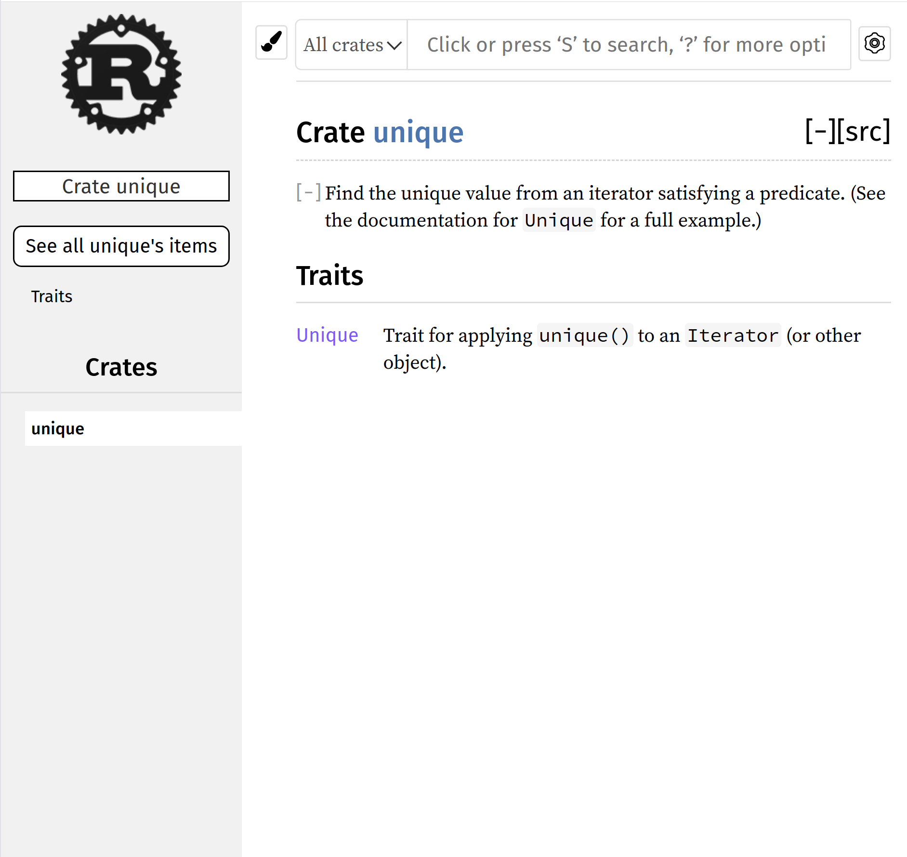
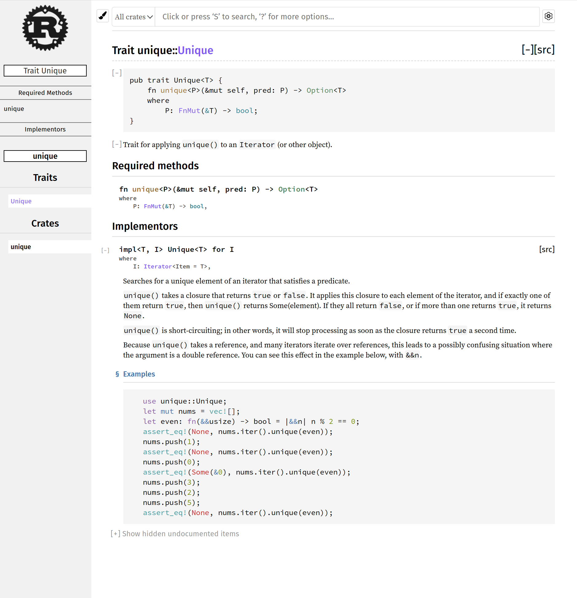

Rust `std` provides the `any()` and `all()` methods
iterators\: these correspond to logical existential (∃) and
universal (∀) quantifiers. In this assignment we will
provide a corresponding `unique()` method implementing the
unique existential (∃!) quantifier.

## Assignment

Here is some documentation for a library crate called
`unique`:

-----

-----

-----

Your job is to implement this crate exactly as shown. Note
that the documentation provides the exact interface you need
to use: all that is needed is to provide the trait
implementation that provides the `unique()` function over
`Iterator`. When you are done, the doctest shown in the
documentation should pass when you run `cargo test`.

## Hints

* Since you have only been given the documentation as
  images, you will have some retyping to do. I don't think
  it's going to take too long. Be careful to get it right,
  though.

* The new code you have to write shouldn't be too big or too
  fancy. Just loop through the iterator looking for matches
  against the predicate.

## Requirements

Your library crate implementation should contain adequate
tests (implemented using `#[test]` unit-testing) and
assertions (implemented using `assert!()` and related
macros). Your code should be formatted according to the
official Rust formatting style — use `cargo fmt` to reformat
your code in-place. Your code should produce no compiler
warnings, and `cargo clippy` should also produce no
warnings. Please do not disable warnings except in the most
unusual circumstances: fix them instead.

Please submit a recursive ZIP archive of a single directory
`one` containing:

* Your `Cargo.toml` and `Cargo.lock`.

* Your `src/lib.rs`.

* Any other source or other text files that are
  necessary/useful.

* A `README.md` file in Markdown format giving a writeup of
  what you did, how it went, and how you tested your work.

* Nothing else. Not your git repo. None of the funny Mac
  garbage files. Not your `target/` directory.
